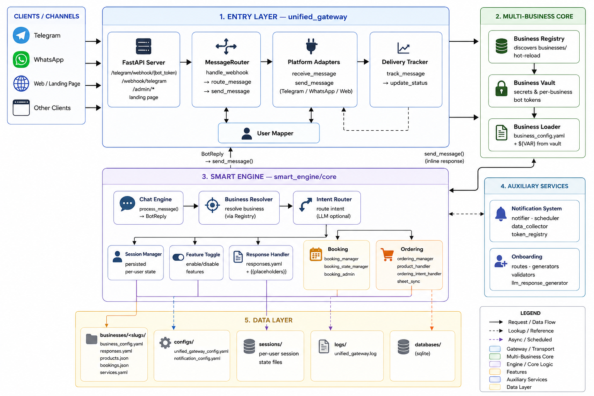

# YoBotz Lite

## About YoBotz

YoBotz is a modular conversational automation system that gives businesses an intelligent interface for handling customer interactions through messaging platforms. It turns natural-language customer requests into structured actions: bookings, answers to common questions, and other business-specific workflows.

**Design principles:**

- **Layered architecture**: message transport, conversation orchestration, intent processing, business logic, and external integrations are separated, keeping the core independent of any single platform.
- **Configurable foundation**: adapts to different types of businesses with minimal changes.
- **Extensible by design**: additional messaging platforms, storage systems, AI services, and infrastructure such as Redis plug in without changing the core application.
- **AI as a component**: dedicated processing layers interpret requests and pass structured data into deterministic business logic, rather than treating the language model as the entire application.

## About YoBotz Lite

YoBotz Lite is a lightweight, portfolio-focused version of the original YoBotz product and its larger production architecture. It is a simplified, local-focused implementation designed to showcase the project's architectural design, core concepts, and functionality. The repository intentionally omits certain production features, integrations, and infrastructure while preserving the fundamental architecture and design principles of the original system.

> **Note:** The original YoBotz (production) deployment uses Redis for state management and external AI services. YoBotz Lite uses local JSON fallbacks for both and is intended only for local development and portfolio review.

### Demos

**Ordering demo**: cart, categories, variants, and order confirmation.

https://github.com/user-attachments/assets/1a4cbc18-314e-4445-a815-a727ffea4ee9

**Booking demo**: service selection, date/time parsing, and slot validation.

https://github.com/user-attachments/assets/739ea103-787f-4b5b-a793-dc4169d2cd2d

**Owner notification**: order alert delivered to the business owner's Telegram.


---

## Table of Contents

1. [Features](#features)
2. [Architecture](#architecture)
3. [Quick Start](#quick-start)
4. [Configuration](#configuration)
5. [BusinessVault](#businessvault)
6. [Admin API](#admin-api)
7. [Project Structure](#project-structure)
8. [Contributing](#contributing)
9. [Documentation](#documentation)

---

## Features

| Category | Capabilities |
|----------|-------------|
| **Platforms** | Telegram via the unified gateway; adapters are platform-agnostic |
| **Multi-Business** | Independent configurations, secrets, and response templates per business |
| **Ordering** | Cart management, categories, product catalog, variants, `search [query]`, order confirmations, inquiry-mode orders |
| **Booking** | Time-slot reservations, natural language date parsing, availability checks |
| **Inventory Sync** | Pull products from Google Sheets; offline fallback to cached catalog |
| **Notifications** | Per-business Telegram bot alerts for orders, bookings, and system events |
| **Session Persistence** | Redis with automatic JSON fallback |
| **Concurrency** | Thread-safe session management for concurrent users |
| **Onboarding** | Multi-step customer registration wizard with LLM-powered response generation |
| **Landing Page** | Public chat widget and business setup wizard, embeddable on any website |

> **Note:** YoBotz Lite includes a functional implementation of the landing page and onboarding flow, but these components are not considered finalized. They are included primarily to demonstrate the intended architecture and workflow and may differ from the more complete implementation used in the production system.

### LLM-Assisted Onboarding

During business onboarding, an LLM can be used to generate initial response templates from provided business information, reducing the manual effort required to configure a new business. These generated templates become part of the business configuration and are then used by the chatbot during normal operation.

---

## Architecture



### Key Components

| Component | Responsibility |
|-----------|---------------|
| `unified_gateway/` | FastAPI server, platform adapters, webhooks, message routing, delivery tracking, user mapping |
| `smart_engine/core/` | Intent classification, session management, response templating, feature toggles |
| `smart_engine/features/` | Ordering and booking workflow managers (incl. reservation time validation, sheet sync) |
| `notification_system/` | Telegram alert delivery, daily summaries, log monitoring |
| `businesses/` | Per-business YAML configs, product catalogs, response templates |
| `core/business_vault.py` | Per-business secrets (Redis or file-backed) |
| `core/business_registry.py` | Auto-discovery, hot-reload, admin management |
| `core/business_loader.py` | Config loading with `${VAR}` expansion from the vault |
| `onboarding/` | Customer registration wizard and business setup API |

---

## Quick Start

### Prerequisites

- Python 3.8+
- Redis (optional; JSON fallback included)
- Telegram Bot Token

### Installation

```bash
git clone https://github.com/Maedza/YoBotz_lite.git
cd YoBotz_lite
pip install -r requirements.txt
```

### Running

```bash
python3 -m uvicorn unified_gateway.server:app --host 0.0.0.0 --port 8000
```

The server listens on `http://localhost:8000`.

### Minimum setup

1. Create a bot with @BotFather on Telegram and copy its token.
2. Create `businesses/yo_bakery/.env` and add:

   ```
   BOT_TOKEN=your_bot_token
   NOTIFICATION_BOT_TOKEN=your_bot_token
   ```

   You can use the same token for both. No chat ID is needed: send a message
   to your bot and the system picks up your chat automatically, so owner
   notifications start arriving.

3. Start the server (see Running above).

   No root `.env` is required. It only holds developer and team settings
   (Redis, logging, LLM keys, and the dev bots).

### Checking that it started

The uvicorn output in your terminal shows the server running on port 8000.
Once you message your bot, notifications for that business start arriving.

### Quick setup with a public webhook URL (requires [ngrok](https://ngrok.com))

```bash
python3 auto_setup_gateway.py
```

This starts an ngrok tunnel, boots the gateway, and auto-configures Telegram webhooks. Press Ctrl+C to stop everything cleanly.

---

## Configuration

### Environment Variables

YoBotz Lite uses **two `.env` files**, one per scope. Both are gitignored; never commit real tokens.

#### `businesses/{name}/.env`: business secrets

One per business. Stores the secrets for **that business only**: its own bot, its notification bot, and its chat IDs. Read by BusinessVault (file mode).

```env
# Telegram bot for this business
BOT_TOKEN=yo_bakery_bot_token

# Bot that sends alerts to the business owner
NOTIFICATION_BOT_TOKEN=yo_bakery_notification_token

# Who receives those alerts
BUSINESS_OWNER_CHAT_ID=<owner_chat_id>
```

> Note the key is `BOT_TOKEN` here, not `TELEGRAM_BOT_TOKEN`. That distinction keeps business tokens separate from the system token below.

#### Root `.env`: system secrets (devs and team)

A single file at the project root. Holds **system-level** settings: which business is the default, Redis, logging, and the Telegram bots owned by **the devs/team**, not by any business. These are fallbacks when a business has no vault value.

```env
# Which business handles unidentified chats
DEFAULT_BUSINESS=yo_bakery

# Dev/team bots (separate from business bots)
TELEGRAM_BOT_TOKEN=your_platform_bot_token
NOTIFICATION_BOT_TOKEN=your_team_notification_token
DEVELOPER_CHAT_ID=123456789

# Infra
REDIS_URL=redis://localhost:6379/0

# Server
TELEGRAM_SERVER_HOST=0.0.0.0
TELEGRAM_SERVER_PORT=8000
TELEGRAM_HOT_RELOAD=false
TELEGRAM_WEBHOOK_SECRET=

# Logging
LOG_LEVEL=INFO
LOG_FORMAT=text
DEBUG=false

# LLM keys (used by LLM-assisted onboarding)
HF_TOKEN=your_huggingface_token
GROQ_API_KEY=your_groq_api_key

# Apps Script (default for product endpoints; per-business override in vault)
APPS_SCRIPT_DEFAULT_TOKEN=
```

**In short:** the root `.env` is for the system and the team; `businesses/{name}/.env` is for a single business. A business's own bots live in its own file, separate from the dev/team bots.

### Business Configuration

Each business in `businesses/{name}/` has:

| File | Purpose |
|------|---------|
| `business_config.yaml` | Feature toggles, business hours, AI model settings, reservation rules |
| `responses.yaml` | Parameterized response templates for all intents |
| `products.json` | Product catalog (ordering feature; may be generated by sheet sync) |
| `services.yaml` | Service definitions (booking feature) |
| `.env` | Per-business secrets (BusinessVault file mode) |

Example feature toggles in `business_config.yaml`:

```yaml
features:
  enable_ordering_system: true
  enable_booking_system: true
  enable_reservation_mode: true
```

### Response Templates

Messages support two placeholder mechanisms, both resolved at runtime:

1. **Business-config placeholders**: `{{hours}}`, `{{address}}`, `{{phone}}`, `{{email}}` are replaced from `business_config.yaml`, so config changes propagate without regenerating responses.
2. **Format variables**: `{variable}` style, populated by the engine (e.g. `{day_display}`, `{business_hours}`, `{business_name}`).

```yaml
day_selected_prompt: |
  Selected: {day_display}
  Business hours: {{hours}}
  Enter your preferred time (e.g., 14:00):
```

---

## BusinessVault

YoBotz Lite uses **BusinessVault** for secure, isolated secrets management per business.

### Storage Modes

The mode is picked automatically: if `REDIS_URL` is set in the root `.env`, secrets live in Redis; otherwise the vault reads from the business's `.env` file.

| Mode | Backend | Use Case |
|------|---------|----------|
| `redis` | Redis server (when `REDIS_URL` is set) | Production, shared infrastructure |
| `file` | `businesses/{name}/.env` (default) | Development, single-machine |

### Usage

In **file mode** you never touch code; just create `businesses/{name}/.env` (see [Environment Variables](#environment-variables)) and the vault reads it automatically. Use the Python API only for programmatic access (Redis mode or custom keys):

```python
from core.business_vault import BusinessVault

vault = BusinessVault("yo_bakery")

# Convenience accessors
token = vault.bot_token
notif_token = vault.notification_bot_token
chat_ids = vault.chat_ids

# Generic API
vault.get_secret("CUSTOM_KEY")
vault.set_secret("KEY", "value")   # persists in Redis mode; in-memory only in file mode
vault.list_secrets()
```

### Adding a New Business

1. Create a directory `businesses/{new_business}/` with `business_config.yaml`, `responses.yaml`, and any catalogs (or use the onboarding wizard to generate them).
2. Register secrets in the vault (file mode: a `.env` in the business directory; redis mode: `set_secret`).
3. Restart the gateway; the `BusinessRegistry` auto-discovers the new directory, or call `POST /admin/reload`.

---

## Admin API

The gateway exposes admin endpoints for managing businesses, vault secrets, hot-reload, and product sync; full reference in the [Gateway API Reference](unified_gateway/README.md). Admin endpoints are unauthenticated in this build. Run locally, or put them behind a reverse proxy, VPN or auth layer before exposing them.

---

## Project Structure

```
YoBotz_lite/
├── auto_setup_gateway.py     One-command ngrok + uvicorn launch
├── unified_gateway/          FastAPI server, adapters, webhooks, routing
│   ├── adapters/             Platform adapters (receive/send)
│   ├── server.py             FastAPI application
│   ├── router.py             Message routing + delivery tracking
│   ├── message_queue.py      Optional Redis-backed processing
│   └── user_mapper.py        Platform user ↔ internal identity mapping
├── smart_engine/             Business logic layer
│   ├── core/                 Intent routing, sessions, responses, toggles
│   └── features/             Ordering and booking workflows
├── notification_system/      Telegram notifications, summaries, log monitor
├── core/                     Cross-cutting infrastructure
│   ├── business_vault.py     Per-business secrets
│   ├── business_registry.py  Auto-discovery and hot-reload
│   └── business_loader.py    Config loading with vault sync
├── onboarding/               Business setup + customer registration API
├── businesses/               Per-business configs and data
├── landing page/             Public chat widget and setup wizard
├── data/                     Shared configs, sessions, logs, databases
├── requirements.txt          Python dependencies
└── tools/                    Standalone utilities
```

---

## Contributing

Contributions are welcome. Read [CONTRIBUTING.md](CONTRIBUTING.md) first; it covers the code quality guidelines and the required PR body template.

**PR body requirements**: every pull request must include:

| Section | What to fill in |
|---------|-----------------|
| **Summary** | What the change does |
| **Why** | The problem it solves |
| **Changes** | Bullet list of main changes |
| **Testing** | How it was verified |
| **Related Issues** | Issue links or `N/A` |
| **Checklist** | Confirm code quality rules were followed |

The full template is in [CONTRIBUTING.md, Pull Requests](CONTRIBUTING.md#pull-requests). PRs without a completed template will be sent back for updates.

---

## Documentation

- [RESERVATION_CONFIG.md](RESERVATION_CONFIG.md): Reservation and booking setup
- [LOGGING_GUIDELINES.md](LOGGING_GUIDELINES.md): Logging standards
- [CONTRIBUTING.md](CONTRIBUTING.md): Contribution guidelines
- [unified_gateway/README.md](unified_gateway/README.md): Gateway API reference
